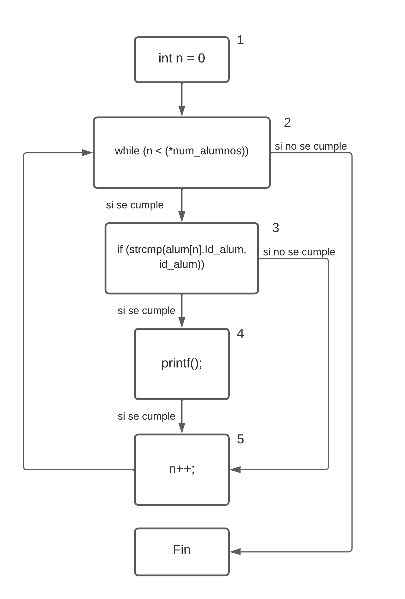

# Cuaderno Digital

Documentacion de Usuario
=

Descripción funcional
-
Este programa esta diseñado para ser un apoyo para el profesor de una clase en una escula. Este programa es capaz de administrar el horario, las asignaturas y laos alumnos que tiene un profesor.

Tecnologia
-
Los programas utilizados son visual studio code, tannto para la codificacion como para el git y el markdoun.

Instalaccion
-
Para la instalacion solo es necesario tener el archivo de ejecucion junto a los archivos de carga y descarga.

Acceso al sistema
-
Al abrir el programa, lo primero es iniciar sesion en el sistema, si es correcto, te aparece un menu con todas las opciones, despues es solo necesario seleccionear la opcion de salir y se termina la ejecucion del programa.

Manual de referencia
-

mediante esta aplicacion el profesor puede tener organizado de forma mas comoda tanto los alumnos como las asignaturas. Ademas desde el puento de vista del administrador, que en este caso seria en centro, puedes organiar de forma mas sencilla tus profesores y alumno.

Guia del operador
-
1. Si corresponde al perfilProfesor:Aparecerá una lista con todos los grupos y materias a los que imparte clases en ese día, con elobjetivo de que el profesor seleccione con qué grupo quiere trabajar en ese momento.
  
    
    
    A continuación aparecerá el siguiente menú en pantalla. Suponiendo este ejemplo de selección degrupo y materia:

    

    1. La primera opción mostrará la lista de todos los alumnos del grupo seleccionado que estánmatriculados en la materia correspondiente, pudiendo seleccionar algún alumno en concreto.Una vez hecha la selección se permitirán las siguientes acciones sobre el mismo:
        1. Ficha del alumno.Esta opción mostrará la ficha con los datos personales del alumno y una opción que permitaal profesor la edición para modificar esos datos.

        2. Calificaciones del alumno.Esta opción mostrará la lista de las calificaciones que tiene actualmente el alumno en esamateria,  y  un  menú  de  opciones  para  modificar  una  calificación  de  la  lista,  borrarla  oañadir una nueva al alumno actual.
        
        3. Volver.Esta opción permitirá al usuario volver al menú anterior.

        

    2. La segunda opción permitirá al profesor cambiar de grupo y materia mostrando de nuevo lalista inicial de selección
      
2.  Si corresponde al perfilAdministrador:En el caso de que sea un usuario administrador, el menú que aparecerá en pantalla será el siguiente:

    

    a.  UsuariosPermitirá  al  administrador  gestionar  los  usuarios  del  sistema  pudiendo  dar  de  alta,  baja,modificar y listar usuarios.
    
    b.  Alumnos.Permitirá  al  administrador  gestionar  los  alumnos  del  sistema  pudiendo  dar  de  alta,  baja,modificar  y  listar  alumnos.  Además,  para  un  alumno  seleccionado,  se  permitirá  mostrar  lalista de materias en las que se encuentra matriculado, realizar cambios de matrícula a otrasmaterias, eliminar matrícula en alguna materia y crear nuevas matrículas.
    
    c.  Materias.Permitirá  al  usuario  administrador  gestionar  todas  las  materias  impartidas  en  el  centropudiendo dar de alta, baja, modificar y listar materias.

    d.  Horarios.Permitirá al administrador gestionar todos los horarios de profesores pudiendo añadir horas declase a un profesor concreto, eliminarlas, modificarlas y listar horarios de cada profesor.

Documentación del sistema
=

Especificacion de sitema
-

El problema para una mayor facilidad de los datos para los programadores hemos dividido las funciones segun si maneganlos datos donde se amacenan los datos, y depues los repartimos en tres mododulos, uno para cada participante del grupo. Tras estar hecho todos los modulos, se coordinaran en el main para que el programa funcione correctamente.

Modulos
-

Funciones modulo Usuarios:

- **Menu Principal:**  
    **Precondicion:** que el txt este en el en el directorio donde se alojan los archivos  
    **Poscondicion:** Un vector de la estructura usuario cargada con la informacion del archivo  
    ***void cargarUsuarios(usuario\*\* vUsuarios, int\* nUsuarios);***
- **Gestionar usuarios;**  
    **Precondicion:** el vector de datos a alojar  
    **Poscondicion:** almacena en el archivo elegido  
    ***void descargarUsuarios(usuario\* vUsuarios, int\* nUsuarios);***  

- **Cargar usuarios;**  
    **Precondicion:** se le da el vector de usuarios  
    **Poscaoncicion:** pausa la ejecucion del codigo hasta que se inicie sesion alguien correctamente  
    ***int menuPrincipal(usuario\* vUsuario, int \*nUsuario);***

- **Descargar usuarios**  
    **Precondicion:** se le da el vector de usuarios  
    **Poscondicion:** muetra las diferentes opciones y las realiza  
    ***void gestionarUsuario(usuario\*\* vUsuarios, int\* nUsuarios);*** 

Funciones modulo Alumnos:
- **Cargar alumnos**  
    **Precondicion:** recibe un puntero a un puntero de alumnos y un entero para almacenar la cantidad de alumnos del sistema  
    **Poscondicion:** devuelve el puntero inicializado con los alumnos del fichero y el numero de alumnos  
    ***void CargarAlumnos(alumnos\*\* alum, int\* num_alumnos);***

- **Descargar alumnos**  
    **Precondicion:** recibe un puntero de alumnos inicializado y el numero de alumnos  
    **Poscondicion:** guarda en el fichero "alumnos.txt" los datos del puntero  
    ***void GuardarAlumnos(alumnos\* alum, int\* num_alumnos);***

- **Listar alumnos**  
    **Precondicion:** recibe un puntero de alumnos y el numero de alumnos del sistema  
    **Poscondicion:** muestra por pantalla todos los alumnos del sistema  
    ***void ListarAlumnos(alumnos\* alum, int\* num_alumnos);***

- **Listar alumnos de un grupo concreto**  
    **Precondicion:** recibe un puntero de alumnos, un string del grupo para listar y el numero de alumnos  
    **Poscondicion:** muestra por pantalla los alumnos pertenecientes al grupo dado  
    ***void ListarAlumnosDeGrupo(alumnos\* alum, matriculas\* matric, char\* grupo, char\* id_materia, int\* num_alumnos, int\* num_matric);***

- **Mostrar Ficha de un alumno**  
    **Precondicion:** recibe un puntero de alumnos, un id de alumno del sistema y el numero de alumnos  
    **Poscondicion:** muestra por pantalla los datos de ese alumno en concreto  
    ***void MostrarFichaAlumno(alumnos\* alum, char\* id_alum, int\* num_alumnos);***

- **Modficiar alumno**  
    **Precondicion:** recibe un puntero de alumnos, un id del alumno del sistema y el numero de alumnos  
    **Poscondicion:** permite modificar uno de los alumnos segun su id  
    ***void ModificarAlumno(alumnos\*\* alum, char\* id_alum, int\* num_alumnos);***

- **Alta alumno**  
    **Precondicion:** recibe un puntero de alumnos y el numero de alumnos del sistema  
    **Poscondicion:** añade un alumno nuevo al puntero e incrementa en 1 el numero de alumnos  
    ***void AltaAlumno(alumnos\*\* alum, int\* num_alumnos);***

- **Baja alumno**  
    **Precondicion:** recibe un puntero de alumnos , el id del alumno y el numero de alumnos del sistema  
    **Poscondicion:** elimina un alumno del puntero y decrementa el numero de alumnos en 1  
    ***void BajaAlumno(alumnos\*\* alum, int id_alum, int\* num_alumnos);***

Funciones modulo Materias:
- **Cargar materias**  
    **Precondicion:** Vector dinámico de materias vacio y un puntero a entero con el numero de materias  
    **Poscondicion:** Vuelca en el vector dinámico el contenido del fichero "materias.txt" y guarda el número de materias en su variable  
    ***void CargarMaterias(materias\*\* mat, int\* num_materias);***

- **Descargar materias**  
    **Precondicion:** Vector dinámico de materias con valores y el número de materias del vector  
    **Poscondicion:** Guarda en el fichero "materias.txt" el contenido del vector dinámico  
    ***void GuardarMaterias(materias\* mat, int\* num_materias);***

- **Listar materias**  
    **Precondicion:** Vector dinámico de materias con valores y el número de materias del vector  
    **Poscondicion:** Imprime por pantalla todas las materias del vector de una en una  
    ***void ListarMaterias(materias\* mat, int\* num_materias);***

- **Alta materias**  
    **Precondicion:** Vector dinámico de materias con valores y el puntero del número de materias  
    **Poscondicion:** Añade al vector una nueva materia e incrementa en 1 el número de materias  
    ***void AltaMaterias(materias\*\* mat, int\* num_materias);***

- **Baja materias**  
    **Precondicion:** Vector dinámico de materias con valores, una cadena de caracteres con el id de la materia a eliminar y el puntero de número de materias  
    **Poscondicion:** Elimina del vector la materia pasada por parámetro y decrementa en 1 el número de materias  
    ***void BajaMaterias(materias\*\* mat, char\* id_mat, int\* num_materias);***

- **Modificar materia**  
    **Precondicion:** Vector dinámico de materias con valores, una cadena de caracteres con el id de la materia a modificar y el número de materias  
    **Poscondicion:** Modifica del vector la materia pasada por parámetro  
    ***void ModificarMateria(materias\*\* mat, char\* id_mat, int\* num_materias);***

Funciones del modulo Matricula:
- **Cargar matriculas**  
    **Precondicion:** Puntero a vector dinámico vacío y puntero entero de número de matriculas  
    **Poscondicion:** Vuelca en el vector dinámico el contenido del fichero "matriculas.txt" y guarda el número de matrículas en la variable pasada por parámetro  
    ***void CargarMatriculas(matriculas\*\* matric, int\* num_matric);***

- **Descargar matriculas**  
    **Precondicion:** Vector dinámico de matrículas con valores y el número de matrículas  
    **Poscondicion:** Guarda en el fichero "matriculas.txt" el vector dinámico de matrículas  
    ***void GuardarMatriculas(matriculas\* matric, int\* num_matric);***

- **Listar materias de una matricula concreta**  
    **Precondicion:** Vector dinámico de matrículas, cadena de caracteres de id del alumno, número de matriculas y Vector dinámico de materias  
    **Poscondicion:** Imprime por pantalla la lista de materias en las que está matriculado un alumno en concreto  
    ***void ListarMateriasMatricula(matriculas\* matric, char\* id_alum, int\* num_matricula, materias\* materia);***

- **Listar alumnos de una matricula concreta**  
    **Precondicion:** Puntero a vector dinámico de caracteres vacío, cadena de caracteres con el id de la materia, vector dinámico de matrículas, número de matriculas y puntero entero del número de ids  
    **Poscondicion:** Guarda en el vector dinámico ids los ids de los alumnos que están matriculados en una determinada materia y guarda el número de ids  
    ***void ListaAlumnosMatricula(char\*\* ids, char\* id_materia, matriculas\* matric, int\* num_matric, int\* num_ids);***

- **Modificar matricula**  
    **Precondicion:** Vector dinámico de matrículas, cadena de caracteres de id de alumno, cadena de caracteres con un id de materia, cadena de caracteres con otro id de materia y número de matrículas  
    **Poscondicion:** Modifica una materia de la lista de matrículas de un alumno en concreto   
    ***void ModificarMatricula(matriculas\*\* matric, char\* id_alum, char\* id_antiguaMat, char\* id_nuevaMat, int\* num_matric);***

- **Eliminar matricula**  
    **Precondicion:** Vector dinámico de matrículas, cadena de caracteres de id del alumno, cadena de caracteres de id de materia y puntero a número de matrículas  
    **Poscondicion:** Elimina del vector dinámico una matrícula de un alumno en concreto y decrementa en 1 el valor del número de matrículas  
    ***void EliminarMatricula(matriculas\*\* matric, char\* id_alum, char\* id_mat, int\* num_matric);***

- **Crear matricula**  
    **Precondicion:** Vector dinámico de matrículas, cadena de caracteres de id del alumno, cadena de caracteres con el id de la materia y puntero a número de matrículas  
    **Poscondicion:** Añade al vector dinámico una nueva matrícula e incrementa en 1 el número de matrículas  
    ***void CrearMatricula(matriculas\*\* matric, char\* id_alum, char\* id_mat, int\* num_matric);***

Plan de prueba
-

### Pruebas modulo Usuarios
  
La funcion elegida para este modulo es la funcion de inicio de sesion:

~~~
int iniciarSesion(char* s_usuario, char* s_contrasenna, usuario* vUsuario, int nUsuario){

    int i = 0;
    int salida = 0;

    do {

        if (strcmp(s_usuario, vUsuario[i].Usuario) == 0){
            if (strcmp(s_contrasenna, vUsuario[i].Contrasenna) == 0){
                salida = 1;
            }
        }
        i++;

    } while (salida && i < nUsuario);

    return salida;

}
~~~
como podemos observar enn esta  funcion, los parametros de entrada son 4, dos cadena de caracteres que son el usuario y contraseña, un vector de la estructuara usuario, y por ultimo un entero con el numero masximos de elementos en el vector.
    
Esta funcion se encarga de comprobar primero que el usuario existe en el vector, y so es asi que la contraseña dada sea igual a la que hay almavenada.
    
1. Pruebas de caja negra 
  
  
    Para este caso la funcion esta preparada para que dado cualquier cadena devuelva 1 si esta cadena de usuario esta en el vector y coincide la contraseña o 0 si es cualquier otro usuario. siendo estos casos dos, que el usuario se encuantre y que la contraseña no coincidan o que el usuario no se encuentre, asi que esas seran las tres pruebas de caja negra.

    Ademas hay que tener en consideracion lo diferentes tipos del tamaño para el vector. En este caso tomaremos los caos en que el vector sea de tamaño 1, 2, y un tamaño albitrario, que en este caso sera 5.

    | Usuario | contraseña | Tam_vec | salida |
    | -- | -- | -- | -- |
    | Existe | Existe | 1 | 1 |
    | Existe | No Existe | 1 | 0 |
    | No Existe | Indiferente | 1 | 0 |
    | Existe | Existe | 2 | 1 |
    | Existe | No Existe | 2 | 0 |
    | No Existe | Indiferente | 2 | 0 |
    | Existe | Existe | 5 | 1 |
    | Existe | No Existe | 5 | 0 |
    | No Existe | Indiferente | 5 | 0 |
      

2. Pruebas de caja blanca 
  
    Para este caso hay que intentar que tosos los posibles casos dados en la funcion sean recorridos. Para esto utilizaremos una de los metodos aprendidos en clase para hace esto. 
    
    Primero realizamos un esquema del algoritmo de esta forma 

    
      
    Los metos para obtener las posibles rutas:
      
    - Numero de aristas - Numero de nodos + 2 = 9 - 7 + 2 = 4
    - Numero de nodos prediscados + 1 = 3 + 1 = 1
    - nuero de regiones = 4
      
    Para de esta forma sabemos el numero de runas no dependiantes de otras, y estas son:

    1. 1 - 2 - 5 - 6 - 2 - 3 - 4 - 6 - 7
    2. 1 - 2 - 3 - 4 - 5 - 6 - 7
    3. 1 - 2 - 3 - 5 - 6 - 7
    4. 1 - 2 - 5 - 6 - 7
      
    Las cuales se comprueban con un vector de tamaño 2 y poner en cada caso poner un usuario y contraseña diferentes.

    En este caso si el usuario y contraseña son correctos puede ir a uno de los dos, el 2, en el que el usuario correcto es el primer elemento, y el resto de casos accede al camino 1.

    Para el caso de que sea el usuario correcto pero la contraseña no, usara el camino 3

    Por ultimo el caso en que el usuario no esta, que es el caso 4
    

-

### Pruebas modulo Alumnos

La funcion elegida para este modulo es la funcion de Mostrar la ficha de un alumno ya que es la mas compleja del modulo:

~~~
void MostrarFichaAlumno(alumnos* alum, char* id_alum, int* num_alumnos){
    int n = 0;

    while (n < (*num_alumnos))
    {
        if (strcmp(alum[n].Id_alum, id_alum)){
            printf("%s-%s-%s-%s-%s-%s", alum[n].Id_alum, alum[n].Nombre_alum, alum[n].Direc_alum, alum[n].Local_alum, alum[n].Curso, alum[n].Grupo);
        }
        n++;
    }
}
~~~

en esta funcion tenemos 3 parametros de entrada, el primero que es un puntero a tipo alumnos, una cadena de caracteres que es el id del alumno para mostrar y un puntero a entero con la cantidad de alumnos del vector pasado en el primer parametro.

Esta funcion se encarga de mostrar por pantalla todos los datos de un alumno en concreto.

1. Pruebas de caja negra

    Para este caso vamos a poner que un 1 en el resultado es que todo ha salido como deberia y un 0 que ha habido algun error dependiendo de los parametros de entrada.
    Además vamos a tomar el vector en los casos que tenga tamaño 1, 2 y 5 para estas pruebas.
    
    | Vector Alumno | Id alumno | Tam_vector | Resultado |
    | -- | -- | -- | -- |
    | Existe | Existe | 1 | 1 |
    | Existe | No existe | 1 | 1 |
    | No existe | No existe | 1 | 0 |
    | Existe | Existe | 2 | 1 |
    | Existe | No existe | 2 | 1 |
    | No existe | No existe | 2 | 0 |
    | Existe | Existe | 5 | 1 |
    | Existe | No existe | 5 | 1 |
    | No existe | No existe | 5 | 0 |

2. Pruebas de caja blanca

    Para esta prueba vamos a recorrer todos los posibles casos de la funcion.
    Primero realizaremos el diagrama de flujo del algoritmo:
    
    
    
    Los metodos para obtener las rutas:
    
    - Numero de aristas - Numero de nodos + 2 = 7 - 5 + 2 = 4
    - Numero de nodos predicados + 1 = 2 + 1 = 3
    - Numero de regiones = 3
    
    Ahora se van a mostrar el numero de rutas no dependientes de otras:
    
    1. 1 - 2 - 3 - 4 - 5 - 2
    2. 1 - 2 - 3 - 5 - 2
    3. 1 - 2 - 3 - 5 - 2 - 3 - 4 - 5 - 2
    
    Estas se han comprobado en un vector de tamaño 2 y utilizando un id de alumno distintos en cada caso.
    
    Ahora vamos a explicar las rutas:
    Si el id alumno existe puede ocurrir que lo encuentre el primero, por lo que estamos en el caso 1 o que lo encuentre en el siguiente paso del bucle asi que estariamos en el caso 3.
    
    Si el id alumno no existe estariamos en el caso 2 ya que el condicional nunca se cumpliria.

